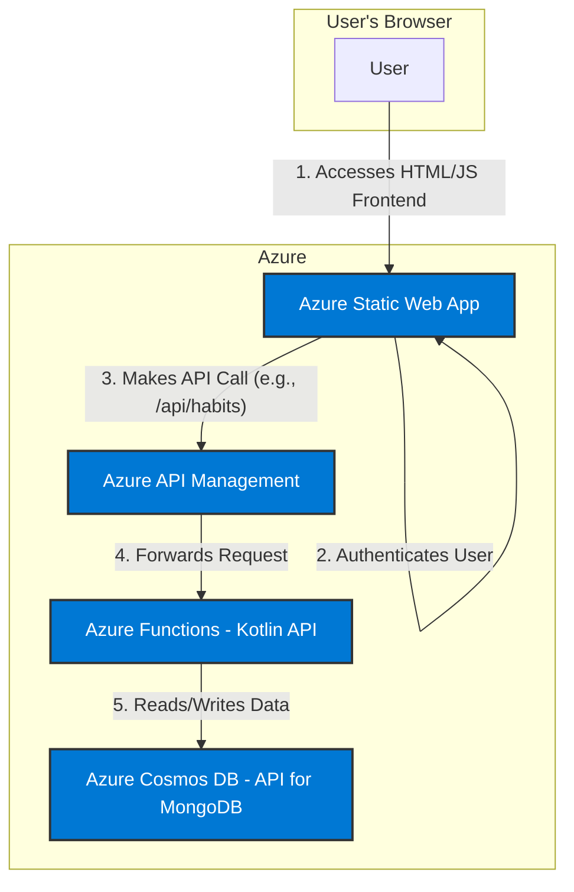

# Architecture Overview: Serverless Habit Tracker

## 1. Problem Statement

The goal is to create a personal, hobby-level habit tracking application. The primary requirements are to use a specific technology stack (Vanilla JS, Kotlin, MongoDB on Azure) for learning purposes, keep it cost-effective, and ensure it is built on a modern, serverless architecture. The system must support basic user authentication and CRUD (Create, Read, Update, Delete) operations for habits.

## 2. High-Level Architecture

The architecture is fully serverless, leveraging managed Azure services to minimize operational overhead and cost.

## 3. Data Flow

1.  **User Interaction:** The user opens the web application in their browser.
2.  **Authentication:** The Azure Static Web App service intercepts the request. If the user is not logged in, it handles the authentication flow with the configured provider (e.g., GitHub, Microsoft). Once authenticated, the user's identity is securely available to the application.
3.  **API Request:** The client-side JavaScript makes an API call to a defined endpoint (e.g., `/api/habits`) to fetch or modify data. This request is directed to Azure API Management.
4.  **API Gateway:** Azure API Management receives the request. It validates the request and forwards it to the appropriate Azure Function that handles the business logic.
5.  **Business Logic & Data Persistence:** The Azure Function (written in Kotlin) executes the business logic. It connects to the Azure Cosmos DB instance using the MongoDB connection string to perform the required database operations (e.g., find, insert, update).
6.  **Response:** The data flows back through the same components to the user's browser, which then updates the UI.

## 4. Key Design Decisions

*   **Serverless-First:** All components are serverless (Static Web Apps, Functions, Cosmos DB Serverless, APIM Consumption). This eliminates server management and ensures a pay-for-what-you-use cost model, which is ideal for a hobby project.
*   **Managed Services:** We are using managed PaaS (Platform-as-a-Service) offerings for all components. This shifts the responsibility of maintenance, patching, and availability from the user to Microsoft.
*   **Decoupled Frontend and Backend:** API Management provides a stable contract between the frontend and backend. This allows the backend implementation to change without affecting the client application.
*   **Integrated Authentication:** Using the built-in authentication of Azure Static Web Apps is the simplest way to secure the application without writing complex identity management code.
